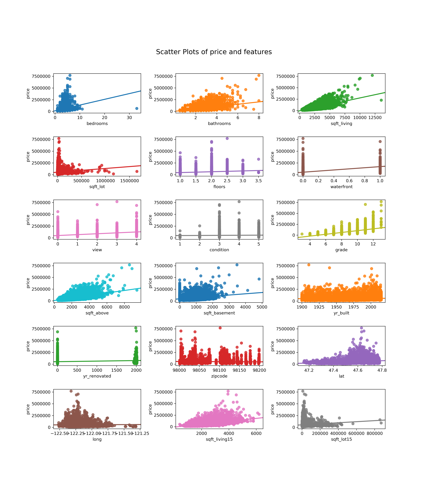

# Modeling the Kings County, Washington housing prices


#### Author: Alvaro Henriquez

## Introduction

The goal of this project is to model real estate prices in Kings County, Washingtion, USA using linear regressin. It is my hope that the model will be able to accurately predict housing prices based on a number of features provided within the dataset that was use to build the model. The expectation is that, once completed, the model can be used by real estate investors operating in the Kings County area as a tool in selecting properties for investment.


## The data
The data used in this project can be found on [Kaggle](https://www.kaggle.com/swathiachath/kc-housesales-data?select=kc_house_data.csvy). It is also included in this repository. Descriptions of the columns can be found in *column_names.MD*.

## Code
Much of the code used to process the data can be found in the *source/resources.py* file. These include: 
1. *preprocess_data()*, Where most of the data manipulation happens
2. *stepwise_selection()* for feature selection
3. *bin_data()* to bin data for use as categorical data
4. *exp_interactions* to find and create interaction terms
5. *add_interactions()* to add the interaction terms to the data
6. *set_waterfront()* to try to estimate if record missing the waterfront value is or is  not a waterfront property
7. *plot_trans()* to aid in visualizing transformation of features.

### Resouces.MD
All of the code in *resouces.py* is documented here.

## Requirements
This project created using Python 3.6.9, Pandas 0.25.1, numpy 1.16.5, matplotlib 3.1.1, scikit-learn 0.21.3, and statsmodels 0.10.1
You will need to do the following imports:
```pyhton
from source.resources import *
import pandas as pd
import numpy as np 
import matplotlib.pyplot as plt
import seaborn as sns

from sklearn.model_selection import train_test_split 
from sklearn.linear_model import LinearRegression
from sklearn.model_selection import cross_val_score
from sklearn.model_selection import KFold
from sklearn.preprocessing import PolynomialFeatures
from sklearn.metrics import mean_squared_error, r2_score

import itertools as it
from statsmodels.regression import linear_model
import statsmodels.api as sm
from statsmodels.formula.api import ols
%matplotlib inline
```
## Scatter plots of predictors vs target
The below image shows the relations between the individual features and the target - *price*. It's evident that there are a number of features that should be treated as categorical.




## Thank you
Thank you for visiting this repo. Please provide feedback so that I can continue to grow in this field. It will be welcomed. 